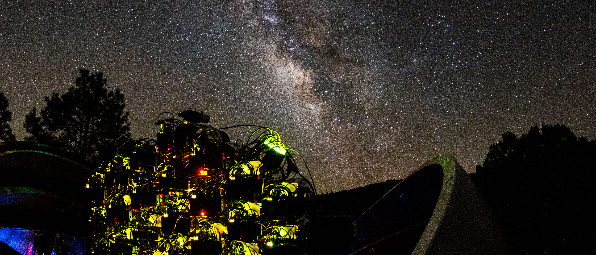

+++
date = "2016-11-05T21:05:33+05:30"
title = "About Me"
image = "imad_face_square.png"
type = "single"
+++
I am a 6th-year graduate student and NSF Graduate Research Fellow at Yale University, working with Prof. Pieter van Dokkum. My work focuses primarily on galaxy evolution, and in particular, my thesis is focused on the baryon cycle in galaxies — how galaxies accrete, proccess, and expel gas — using both novel instrumentation, large telescopes (Keck/Palomar), and simulations. I earned my undergraduate degrees in physics, astrophysics, and (minor) creative writing at UC Berkeley (go bears!) working with Prof. Mariska Kriek. I, along with Deborah Lokhorst, Seery Chen, Pieter, and Bob Abraham (PI) am building and comissioning the Dragonfly Spectral Line Mapper, a novel telephoto array with ultranarrowband filters, targeting emission lines from gas in the Circumgalactic Medium of nearby galaxies.

I have written or co-written several pieces of open source astronomical software, including pysersic, a bayesian profile fitting code for galaxy images, maskfill, a code for robustly filling masks in astronomical images, and silkscreen, a simulation-based inference + CNN based framework for estimating the masses and distances to dwarf galaxies.

I also maintain a website with a free Python textbook oriented towards astronomy and astrophysics students. The site also has numerous guides and tutorials you can download and/or use in your classrooms, as well as some advice columns for undergrads about applying to graduate school, the NSF GRFP, and REUs. I also have a notes/guide book for using the TripleSpec instrument at Palomar. You can find it here. I will soon be releasing a new Python textbook with IOP AAS E-books publishing.

I am actively involved in, and committed to, efforts to create a more equitable and inclusive department community and astrophysics field in general. I believe that science is a human endeavor, and that it is critical we all do the work needed to combat systemic and widespread racism, sexism, and ableism in our field. If you want to talk science, grad admissions/NSF apps, Python pedagogy, or DEI work, I am always happy and eager to chat - please don’t hesitate to reach out.

