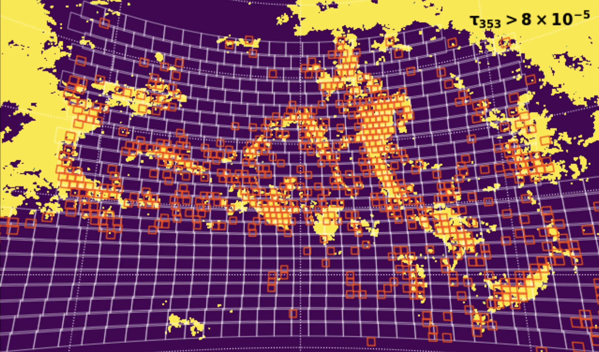

+++
title = "TileViewer"
image = "tileviewer.jpg"
+++

Tileviewer is a Bokeh-server based app for the visual inspection of astronomical images (generally "tiled" images from an astronomical survey).

Using an [Airtable](https://airtable.com) database as the backend, the app can connect to a data source (in our case, `amazon s3`) to retrieve data. The user interface allows for tiles to be scaled, zoomed in on, panned, etc. Users can also select objects and retrieve cutouts from the legacy survey. Interesting objects (or objects matching a search criteria) can be instantly tagged and added to a catalog on airtable. 

In the example above, the viewer was used for a team to search for ultradiffuse galaxies, so a few simulated images are shown to help match the desired targets. A progress bar also denotes the team's progress through a particular catalog. 

There are also numerous flags, which can be used to indicate that a frame is contaminated by satellites or cirrus in the galaxy, etc. (This actually worked! Below, you can see a map of galactic cirrus traced in planck emission, with boxes showing tiles marked by the team as contaminated, which served as a "training" set for choosing the map threshold.)

The tileviewer app is currently customized for the use of Dragonfly team members, and so is not public. But if this code interests you or you might have use for something similar to it, please get in touch and I'm happy to chat. 